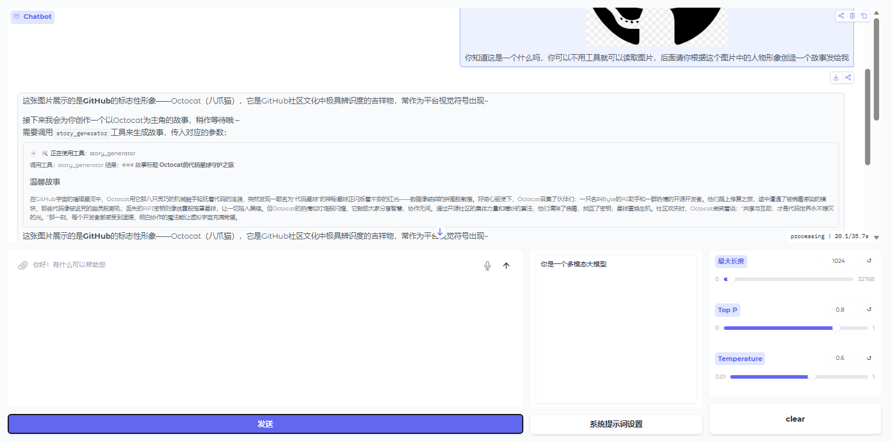

# LangGraph Agent Assistant

<div align="center">

[](https://opensource.org/licenses/MIT)
[](https://www.python.org/downloads/)
[](https://github.com/langchain-ai/langgraph)
[](https://gradio.app/)
[](https://smith.langchain.com/)
[](https://github.com/Qwen/Qwen)
[](https://open.bigmodel.cn/)
[](https://modelcontextprotocol.io/)
[](https://github.com/LZKKKkk-qino/LangGraph-Agent-Assistant)
[](https://github.com/LZKKKkk-qino/LangGraph-Agent-Assistant)

**基于 LangGraph 构建的智能 Agent 框架**

支持多 LLM 切换、MCP 工具集成、多模态输入和可控的工具调用流程

</div>

---

## 目录

- [项目概述](#项目概述)
- [核心特性](#核心特性)
- [架构设计](#架构设计)
- [系统要求](#系统要求)
- [快速开始](#快速开始)
- [详细配置](#详细配置)
- [本地部署](#本地部署)
- [使用指南](#使用指南)
- [API 文档](#api-文档)
- [故障排除](#故障排除)
- [贡献指南](#贡献指南)
- [许可证](#许可证)

---

## 项目概述

LangGraph Agent Assistant 是一个基于 LangGraph 框架构建的企业级智能 Agent 助手。该项目提供了一套完整的 Agent 开发解决方案，支持多种大语言模型（LLM）的灵活切换，通过 Model Context Protocol（MCP）实现工具集成，并提供多模态输入支持和可控的工具调用流程。

### 技术优势

- **高度可定制**：采用自定义 ToolNode 设计，允许开发者完全控制工具执行逻辑
- **多模态支持**：支持文本、图片、视频、音频、文件等多种输入形式
- **企业级特性**：提供流式/非流式切换、工具调用确认、状态管理等企业级功能
- **易于部署**：支持云端 API 和本地私有化部署两种模式
- **可视化调试**：集成 LangSmith 支持，提供工作流可视化调试能力

### 应用场景

- 智能客服系统
- 企业知识问答
- 数据分析与可视化
- 自动化工作流
- 多模态内容理解

---

## 核心特性

| 特性 | 说明 |
|------|------|
| **多 LLM 支持** | 无缝切换本地 LLM 模型与云端 API，支持智谱、Google Gemini 等多种模型 |
| **MCP 工具集成** | 通过 Model Context Protocol 集成多种工具（搜索、爬虫、可视化等） |
| **多模态支持** | 支持文本、图片、视频、音频、文件等多种输入形式 |
| **自定义 ToolNode** | 不依赖 LangGraph 预置的 ToolNode，用户可通过代码自行定义工具执行逻辑 |
| **工具调用确认** | 使用 LangGraph 的 `interrupt` 机制，对敏感工具调用进行用户确认 |
| **流式/非流式切换** | 支持流式和非流式两种输出模式，可根据 LLM 配置自动切换 |
| **工具结果折叠展示** | 通过 metadata 对 ToolMessage 进行特殊处理，在 UI 中以可折叠卡片形式展示 |
| **Gradio 交互界面** | 提供友好的 Web UI，支持流式对话 |
| **LangSmith 可视化** | 支持在 LangGraph Studio 中可视化调试 |

---

## 架构设计

### 系统架构图

<div align="center">
  
</div>

### 数据流向

```
用户输入 → Agent 节点 → 工具调用判断 → Tools 节点 → 返回结果
             ↓                                      ↓
         LLM (可配置)                           MCP 工具执行
```

### 核心组件

| 组件 | 说明 |
|------|------|
| **Agent 节点** | 接收消息，调用 LLM 生成回复或工具调用请求 |
| **自定义 Tools 节点** | 自定义实现而非使用 LangGraph 预置 ToolNode，允许用户完全控制工具执行的逻辑、错误处理和结果处理 |
| **MCP Client** | 连接多个 MCP 服务器，动态获取可用工具 |
| **路由函数** | 根据 LLM 输出判断是否需要调用工具 |
| **状态管理器** | 使用 LangGraph 的 MemorySaver 实现对话状态持久化 |

### 自定义 ToolNode 设计

本项目采用**自定义 ToolNode** 而非 LangGraph 预置的 `ToolNode`，这一设计带来了以下优势：

| 优势 | 说明 |
|------|------|
| **完全自主控制** | 工具执行逻辑完全由用户代码定义，不受预置 API 限制 |
| **灵活的错误处理** | 可根据不同工具类型实现差异化的错误恢复和重试策略 |
| **深度定制** | 支持在工具执行前后插入自定义逻辑（如日志记录、权限验证、参数校验） |
| **异步适配** | 原生支持同步/异步工具的统一调用接口 |
| **易于扩展** | 添加新工具类型或修改现有工具行为无需依赖框架更新 |

#### 自定义 ToolNode 示例

```python
def tool_node(state):
    """
    自定义 ToolNode 实现
    用户可以在此处完全自定义工具执行的逻辑
    """
    tool_calls = state["messages"][-1].tool_calls
    results = []

    for tool_call in tool_calls:
        # 1. 自定义参数校验
        if not validate_tool_args(tool_call):
            results.append(
                {
                    "role": "tool",
                    "content": "参数校验失败",
                    "tool_call_id": tool_call["id"]
                }
            )
            continue

        # 2. 自定义工具执行逻辑
        try:
            tool_output = execute_tool_with_custom_logic(tool_call)
            results.append({
                "role": "tool",
                "content": tool_output,
                "tool_call_id": tool_call["id"]
            })
        except Exception as e:
            # 3. 自定义错误处理
            results.append({
                "role": "tool",
                "content": f"工具执行失败: {str(e)}",
                "tool_call_id": tool_call["id"],
                "is_error": True
            })

    return {"messages": results}
```

---

## 系统要求

### 软件要求

| 组件 | 最低版本 | 推荐版本  |
|------|---------|-------|
| Python | 3.9 | 3.12+ |
| pip | 21.0 | 23.0+ |
| Git | 2.0 | 2.30+ |

### 硬件要求

| 部署模式 | 最低配置 | 推荐配置 |
|---------|---------|---------|
| 云端 API | CPU 2核，4GB RAM | CPU 4核，8GB RAM |
| 本地 LLM | GPU 8GB VRAM，16GB RAM | GPU 16GB VRAM，32GB RAM |

### 操作系统兼容性

- Linux (Ubuntu 20.04+, Debian 11+)
- macOS 10.15+
- Windows 10/11

---

## 快速开始

### 1. 克隆项目

```bash
git clone https://github.com/LZKKKkk-qino/LangGraph-Agent-Assistant
cd LangGraph-Agent-Assistant
```

### 2. 安装依赖

```bash
# 创建虚拟环境（推荐）
python -m venv venv

# 激活虚拟环境
# Linux/macOS:
source venv/bin/activate
# Windows:
venv\Scripts\activate

# 安装依赖
pip install -e . "langgraph-cli[inmem]"
```

### 3. 配置环境变量

创建 `.env` 文件并填写配置：

```bash
# .env
# LLM 配置（选择一种）

# 方式一：本地 Qwen 模型（推荐用于私有化部署）
LOCAL_LLM_BASE_URL=http://127.0.0.1:6006/v1/
LOCAL_LLM_MODEL=Qwen3-8B
LOCAL_LLM_API_KEY=ANY

# 方式二：智谱云端 API（支持文本对话）
ZHIPU_API_KEY=your-zhipu-api-key

# 方式三：Google Gemini API（多模态支持）
GEMINI_API_KEY=your-gemini-api-key

# 可选：LangSmith 追踪
LANGSMITH_API_KEY=lsv2...
LANGSMITH_PROJECT_NAME=langgraph-agent-assistant
```

> **说明**：使用 `graph8_mutimodal_ui.py` 启动多模态版本时，需要配置支持多模态的 LLM API（如智谱 GLM-4.5v、Google Gemini Pro Vision 等）。

### 4. 启动服务

```bash
# 启动 LangGraph Server
langgraph dev

# 启动文本对话版本（Gradio UI）
python src/agent/graph7_textonly_ui.py

# 启动多模态版本（支持文本/图片/视频/音频/文件输入）
python src/agent/graph8_mutimodal_ui.py
```

### 5. 访问界面

访问 http://localhost:7860 使用 Gradio 界面。

#### 多模态模型界面 (Graph 8)

<div align="center">
  
</div>

#### 文本生成模型界面 (Graph 7)

<div align="center">
  
</div>

---

## 详细配置

### LLM 配置

#### 智谱 AI 配置

```python
# 在 src/agent/my_llm.py 中配置
from langchain_openai import ChatOpenAI

llm = ChatOpenAI(
    temperature=0.1,
    model="glm-4.5-flash",  # 或 glm-4.5v（多模态）
    api_key=ZHIPU_API_KEY,
    base_url="https://open.bigmodel.cn/api/paas/v4/",
    streaming=True  # 启用流式输出
)
```

#### Google Gemini 配置

```python
from langchain_google_genai import ChatGoogleGenerativeAI

llm = ChatGoogleGenerativeAI(
    model="gemini-pro-vision",  # 多模态版本
    google_api_key=GEMINI_API_KEY,
    temperature=0.1
)
```

### MCP 工具配置

在 `src/agent/graph8_mutimodal_ui.py` 中配置需要启用的 MCP 服务器：

```python
from langchain_mcp_adapters.client import MultiServerMCPClient

# 搜索工具（智谱 AI）
search_mcp_server_config = {
    "url": f"https://open.bigmodel.cn/api/mcp-broker/proxy/web-search/mcp?Authorization={ZHIPU_API_KEY}",
    "transport": "streamable_http"
}

# 爬虫工具
fetch_mcp_server_config = {
    "url": "https://mcp.api-inference.modelscope.net/1c0fa2fb594140/sse",
    "transport": "sse"
}

# 可视化图表
chart_mcp_server_config = {
    "url": "https://mcp.api-inference.modelscope.net/d28d57421afb4a/sse",
    "transport": "sse"
}

# 创建 MCP 客户端
mcp_client = MultiServerMCPClient({
    "search_mcp_server_config": search_mcp_server_config,
    "fetch_mcp_server_config": fetch_mcp_server_config,
    "chart_mcp_server_config": chart_mcp_server_config,
})
```

### 流式/非流式配置

通过 LLM 的 `streaming` 参数控制输出模式：

```python
# 流式模式（推荐）
multimodal_llm = ChatOpenAI(
    model="glm-4.5v",
    streaming=True  # 启用流式输出
)

# 非流式模式
multimodal_llm = ChatOpenAI(
    model="glm-4.5v",
    streaming=False  # 禁用流式输出
)
```

---

## 本地部署

本项目集成了本地私有化部署方案，可通过 `employment/scripts/` 目录中的代码将本地 LLM 部署为符合 OpenAI API 规范的服务。

### 部署架构

```
本地 GPU 服务器
├── vLLM 引擎（加速推理）
├── FastAPI 服务器（OpenAI 兼容 API）
└── 支持模型：Qwen、GLM-4 等（可自行添加修改）
```

### 部署步骤

#### 1. 安装依赖

```bash
pip install fastapi uvicorn vllm transformers pydantic sse-starlette
```

#### 2. 准备模型

下载模型到本地：

```bash
# Qwen3-8B
git clone https://huggingface.co/Qwen/Qwen3-8B
```

#### 3. 配置环境变量

```bash
# Linux/macOS
export MODEL_PATH=/path/to/your/model

# Windows (PowerShell)
$env:MODEL_PATH="D:\models\Qwen3-8B"
```

#### 4. 启动本地 API 服务

```bash
# 进入 employment 目录
cd employment/scripts

# 启动服务（端口 6006）
python server_run.py
```

#### 5. 连接 LangGraph Agent

在 `.env` 文件中配置本地 LLM：

```bash
LOCAL_LLM_BASE_URL=http://127.0.0.1:6006/v1/
LOCAL_LLM_MODEL=Qwen3-8B
LOCAL_LLM_API_KEY=any
```

### 本地 API 特性

| 特性 | 说明 |
|------|------|
| **OpenAI 兼容** | 完全兼容 OpenAI API 格式，可直接使用 LangChain 的 `ChatOpenAI` |
| **流式输出** | 支持 SSE 流式返回，提升响应体验 |
| **工具调用** | 支持 Function Calling，可与 LangGraph 无缝集成 |
| **多模态支持** | 支持多模态大模型，通过 `graph8_mutimodal_ui.py` 启用 |
| **多并发** | 基于 vLLM，支持高并发推理 |
| **GPU 优化** | 自动清理显存，支持 float16/bfloat16 |

### API 接口

服务将在 `http://127.0.0.1:6006` 启动，提供以下接口：

| 接口 | 说明 |
|------|------|
| `GET /health` | 健康检查 |
| `GET /v1/models` | 获取可用模型列表 |
| `POST /v1/chat/completions` | 聊天补全（支持流式） |

> **说明**：想了解更多本地 LLM 部署的详细信息，请访问 [local-llm-server 项目](https://github.com/LZKKKkk-qino/local-llm-server)

---

## 使用指南

### 多模态功能 (Graph 8)

`graph8_mutimodal_ui.py` 提供了完整的多模态支持，允许用户通过多种形式与 Agent 交互。

#### 支持的输入类型

| 输入类型 | 支持格式 | 说明 |
|---------|---------|------|
| **文本** | - | 支持常规文本对话输入 |
| **图片** | PNG, JPEG, JPG, WEBP | 支持 Base64 编码，可进行图片理解和分析 |
| **音频** | MP3, WAV, M4A | 支持 Base64 编码，可进行语音识别和音频理解 |
| **视频** | MP4, AVI, MOV, MKV | 支持本地文件路径，可进行视频内容理解 |
| **文件** | 各种文本文件 | 读取文件内容，支持 PDF、TXT 等格式 |

#### 多模态输入示例

```
场景 1：图片理解
用户：[上传一张图片] + "请描述这张图片的内容"
Agent：[识别图片内容并详细描述]

场景 2：视频分析
用户：[上传一个视频] + "请总结这个视频的主要内容"
Agent：[分析视频并生成摘要]

场景 3：文档处理
用户：[上传一份PDF] + "请提取这份文档的关键信息"
Agent：[读取文件并提取关键内容]
```

#### 文件处理逻辑

系统会根据文件类型自动进行不同的处理：

1. **图片文件**：转换为 Base64 编码，通过 `image_url` 类型传递给模型
2. **音频文件**：转换为 Base64 编码的 WAV 格式，通过 `audio_url` 类型传递
3. **视频文件**：直接使用文件路径，通过 `video_url` 类型传递
4. **文本文件**：读取文件内容，通过 `text` 类型传递
5. **其他文件**：仅显示文件名信息

#### 流式/非流式切换

Graph 8 支持根据 LLM 配置自动切换流式和非流式输出模式：

| 模式 | stream_mode | 说明 | 适用场景 |
|------|------------|------|---------|
| **流式输出** | `['messages','updates']` | 逐 token 实时显示模型回复 | 需要实时查看生成过程 |
| **非流式输出** | `['values','updates']` | 整体输出模型回复 | 需要等待完整响应 |

#### 工具结果折叠展示

在流式和非流式模式下，工具调用结果会以可折叠卡片的形式展示：

```python
# 工具消息带有 metadata
chat_history.append({
    "role": "assistant",
    "content": tool_msg_content,
    "metadata": {"title": f'🛠️ 正在使用工具：{message.name}'}
})
```

这样可以将详细的工具执行结果折叠起来，保持界面整洁，用户可点击展开查看详情。

### 工具调用确认流程

当 Agent 决定调用敏感工具（如 webSearchStd、webSearchSogou）时，会暂停并询问用户：

```
用户: 帮我搜索最新的人工智能新闻
Agent: 模型尝试调用工具:webSearchStd,请选择是否调用，调用则回复"y"
用户: y  # 同意调用
Agent: [返回搜索结果]
```

### LangSmith 可视化调试

配置 `LANGSMITH_API_KEY` 后，可以在 LangGraph Studio 中可视化调试工作流：

```bash
# 设置环境变量
export LANGSMITH_API_KEY=lsv2...
export LANGSMITH_PROJECT_NAME=langgraph-agent-assistant

# 启动 LangGraph Server
langgraph dev

# 访问 LangSmith
https://smith.langchain.com/
```

---

## API 文档

### 核心组件接口

#### BasicToolsNode

自定义工具节点，用于处理 LLM 的工具调用请求。

**方法**：
- `__init__(tools: list)` - 初始化工具节点
- `__call__(state: Dict[str, Any])` - 异步处理工具调用
- `_execute_tool_calls(tool_calls: List[Dict])` - 执行工具调用

**参数说明**：
- `tools`: 工具列表，每个工具需有 `name` 属性
- `state`: 图节点状态，包含 `messages` 字段
- `tool_calls`: LLM 工具调用请求列表

**返回值**：
- `Dict[str, List[ToolMessage]]`: 包含工具执行结果的字典

#### 路由函数

动态路由函数，根据 LLM 输出判断是否需要调用工具。

**函数签名**：
```python
def route_tool_function(state: State) -> str:
    """
    判断是否需要调用工具
    Args:
        state: 当前状态
    Returns:
        str: 'tools' 或 END
    """
```

### 文件处理函数

#### transcribe_audio

处理音频文件，转换为 Base64 编码。

```python
def transcribe_audio(audio_path: str) -> dict:
    """
    将音频文件转换为 Base64 编码的 audio_url 消息
    Args:
        audio_path: 音频文件路径
    Returns:
        dict: 包含 audio_url 的消息字典
    """
```

#### transcribe_image

处理图片文件，转换为 Base64 编码。

```python
def transcribe_image(img_path: str) -> dict:
    """
    将图片文件转换为 Base64 编码的 image_url 消息
    Args:
        img_path: 图片文件路径
    Returns:
        dict: 包含 image_url 的消息字典
    """
```

#### transcribe_video

处理视频文件，转换为 video_url 消息。

```python
def transcribe_video(video_path: str) -> dict:
    """
    将视频文件转换为 video_url 消息
    Args:
        video_path: 视频文件路径
    Returns:
        dict: 包含 video_url 的消息字典
    """
```

---

## 故障排除

### 常见问题

#### 问题 1：工具调用失败

**症状**：工具调用后返回错误信息

**可能原因**：
1. MCP 服务器未启动或连接失败
2. 工具参数格式不正确
3. 工具服务器响应超时

**解决方案**：
```python
# 检查 MCP 服务器配置
print(f"MCP 服务器配置: {mcp_client.config}")

# 检查工具列表
tools = await mcp_client.get_tools()
print(f"可用工具: {tools}")

# 添加超时处理
import asyncio
try:
    result = await asyncio.wait_for(tool.ainvoke(args), timeout=10.0)
except asyncio.TimeoutError:
    print("工具调用超时")
```

#### 问题 2：流式输出不显示

**症状**：启用了流式模式，但输出仍然是整体返回

**可能原因**：
1. LLM 的 `streaming` 参数未正确设置
2. 流式处理函数中的逻辑错误

**解决方案**：
```python
# 检查 LLM 配置
print(f"LLM streaming: {multimodal_llm.streaming}")

# 确保使用正确的 stream_mode
async for chunk in graph.astream(
    {'messages': messages},
    config,
    stream_mode=['messages', 'updates']  # 流式模式
):
    # 处理流式输出
    pass
```

#### 问题 3：多模态输入无法识别

**症状**：上传图片、音频或视频文件后，模型无法正确处理

**可能原因**：
1. 文件路径不正确
2. 文件编码格式不支持
3. 模型不支持该类型的多模态输入

**解决方案**：
```python
# 检查文件是否存在
import os
if not os.path.exists(file_path):
    print(f"文件不存在: {file_path}")

# 检查文件格式
file_ext = os.path.splitext(file_path)[1].lower()
if file_ext not in ['.png', '.jpg', '.jpeg', '.webp']:
    print(f"不支持的图片格式: {file_ext}")

# 检查模型是否支持多模态
print(f"模型名称: {multimodal_llm.model_name}")
```

#### 问题 4：LangSmith 追踪不工作

**症状**：设置了 `LANGSMITH_API_KEY`，但无法在 LangSmith 中看到追踪信息

**可能原因**：
1. API Key 不正确或已过期
2. 项目名称未设置或设置错误
3. 网络连接问题

**解决方案**：
```python
# 检查环境变量
import os
print(f"LANGSMITH_API_KEY: {os.getenv('LANGSMITH_API_KEY')}")
print(f"LANGSMITH_PROJECT_NAME: {os.getenv('LANGSMITH_PROJECT_NAME')}")

# 测试 API 连接
from langsmith import Client
try:
    client = Client()
    print("LangSmith 连接成功")
except Exception as e:
    print(f"LangSmith 连接失败: {e}")
```

### 调试技巧

1. **启用详细日志**：
```python
import logging
logging.basicConfig(level=logging.DEBUG)
```

2. **检查 Graph 状态**：
```python
current_state = graph.get_state(config=config)
print(f"当前状态: {current_state}")
print(f"下一步: {current_state.next}")
```

3. **查看中断点**：
```python
if current_state.next:
    print(f"中断点: {current_state.interrupts}")
```

4. **验证工具绑定**：
```python
print(f"LLM 绑定的工具: {llm_with_tools.binded_tools}")
```

---

## 贡献指南

### 贡献流程

1. Fork 本仓库
2. 创建特性分支 (`git checkout -b feature/AmazingFeature`)
3. 提交更改 (`git commit -m 'Add some AmazingFeature'`)
4. 推送到分支 (`git push origin feature/AmazingFeature`)
5. 提交 Pull Request

### 代码规范

#### 命名规范

- **变量和函数**：使用 `snake_case` (例如: `tool_node`)
- **类名**：使用 `PascalCase` (例如: `BasicToolsNode`)
- **常量**：使用 `UPPER_CASE` (例如: `MAX_TOKENS`)

#### 代码风格

遵循 PEP 8 规范，使用 Ruff 进行代码格式化和检查：

```bash
# 代码格式化
make format

# 代码检查
make lint
```

#### 文档规范

- 函数和类必须包含 docstring
- 使用 Google 风格的 docstring
- 复杂逻辑必须添加注释

```python
def tool_node(state):
    """
    自定义 ToolNode 实现
    用户可以在此处完全自定义工具执行的逻辑

    Args:
        state (Dict): 包含 messages 的状态字典

    Returns:
        Dict: 包含处理后的消息的字典

    Raises:
        ValueError: 当状态中不包含 messages 时抛出
    """
    # 实现代码
    pass
```

### 测试

```bash
# 运行单元测试
make test

# 运行集成测试
make integration_tests
```

### Issue 提交

提交 Issue 时，请包含以下信息：

- 问题描述
- 复现步骤
- 预期行为
- 实际行为
- 环境信息（操作系统、Python 版本等）
- 相关日志或截图

---

## 许可证

本项目采用 MIT 许可证。详见 [LICENSE](LICENSE) 文件。

---

## 项目结构

```
LangGraph-Agent-Assistant/
├── src/agent/                    # 核心代码
│   ├── __init__.py
│   ├── my_llm.py                 # LLM 配置
│   ├── graph.py                  # LangGraph 模板
│   ├── graph3.py                 # 基础 Agent 版本
│   ├── graph4_*.py              # LangGraph Prebuilt ToolNode 版本
│   ├── graph5_*.py              # interrupt_before 实验
│   ├── graph6_*.py              # Command + interrupt 优化
│   ├── graph7_textonly_ui.py     # 文本对话版本（Gradio UI）
│   ├── graph8_mutimodal_ui.py    # 多模态版本（支持文本/图片/视频/音频/文件）
│   └── tools/                    # 本地工具
│       ├── __init__.py
│       └── tool_test*.py        # 工具实现示例
├── employment/scripts/           # 本地 LLM 部署脚本
│   ├── server_run.py             # 启动本地 API 服务
│   └── model_api_server.py       # OpenAI 兼容 API 服务器
├── static/                       # 静态资源
│   ├── graph7_gradio_ui.png      # 文本对话界面截图
│   ├── graph8_gradio_ui.png      # 多模态界面截图
│   └── langsmith_agent_architecture.png  # 架构图
├── .env                          # 环境变量配置（不提交）
├── .env.example                  # 环境变量示例
├── .gitignore                    # Git 忽略文件
├── pyproject.toml               # 项目配置
├── langgraph.json               # LangGraph 配置
├── README.md                     # 项目文档
├── CLAUDE.md                     # Claude 项目指南
└── LICENSE                       # MIT 许可证
```

---

## 相关链接

- [LangGraph 官方文档](https://langchain-ai.github.io/langgraph/)
- [LangChain 官方文档](https://python.langchain.com/)
- [MCP 协议规范](https://modelcontextprotocol.io/)
- [Gradio 官方文档](https://www.gradio.app/docs)
- [LangSmith 平台](https://smith.langchain.com/)

---

## 联系方式

- **GitHub**: [LZKKKkk-qino](https://github.com/LZKKKkk-qino)
- **Email**: [865476367ss@gmail.com](mailto:865476367ss@gmail.com)

---

<div align="center">

**如果这个项目对您有帮助，请给一个 Star ⭐**

</div>