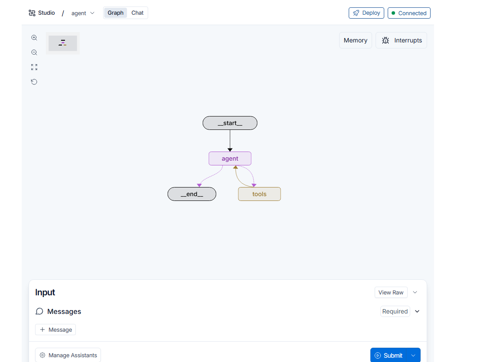
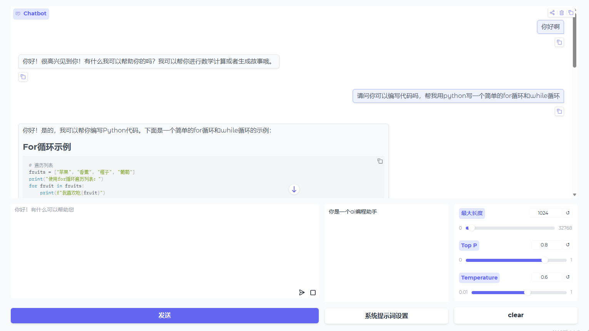

# LangGraph Agent Assistant

一个基于 LangGraph 构建的智能 Agent 助手，支持多 LLM 切换、MCP 工具集成和可控的工具调用流程。

## ✨ 特性

- 🤖 **多 LLM 支持**：无缝切换本地 LLM 模型与云端 API
- 🔧 **MCP 工具集成**：通过 Model Context Protocol 集成多种工具（搜索、爬虫、可视化等）
- 🛡️ **工具调用确认**：使用 LangGraph 的 `interrupt` 机制，对敏感工具调用进行用户确认
- 🎨 **Gradio 交互界面**：提供友好的 Web UI，支持流式对话
- 📊 **LangSmith 可视化**：支持在 LangGraph Studio 中可视化调试

## 🏗️ 架构

<div align="center">
  
</div>

```
用户输入 → Agent 节点 → 工具调用判断 → Tools 节点 → 返回结果
             ↓                                      ↓
         LLM (可配置)                           MCP 工具执行
```

### 核心组件

| 组件             | 说明 |
|----------------|------|
| **Agent 节点**   | 接收消息，调用 LLM 生成回复或工具调用请求 |
| **Tools 节点**   | 执行 LLM 请求的工具调用，支持同步/异步适配 |
| **MCP Client** | 连接多个 MCP 服务器，动态获取可用工具 |
| **路由函数**       | 根据 LLM 输出判断是否需要调用工具 |

## 🚀 快速开始

### 1. 环境准备

```bash
# 克隆项目
git clone https://github.com/LZKKKkk-qino/LangGraph-Agent-Assistant
cd langgraph-agent-assistant

# 安装依赖
pip install -e . "langgraph-cli[inmem]"
```

### 2. 配置环境变量

复制 `.env.example` 到 `.env` 并填写配置：

```bash
cp .env.example .env
```

```bash
# .env
# LLM 配置（选择一种）

# 方式一：本地 Qwen 模型（推荐用于私有化部署）
LOCAL_LLM_BASE_URL=http://127.0.0.1:6006/v1/ OR YOUR_LOCAL_LLM_BASE_URL
LOCAL_LLM_MODEL=Qwen3-8B OR ANY_LOCAL_LLM_MODEL
LOCAL_LLM_API_KEY=ANY

# 方式二：智谱云端 API
ZHIPU_API_KEY=your-zhipu-api-key

# 可选：LangSmith 追踪
LANGSMITH_API_KEY=lsv2...
```

### 3. 启动服务

```bash
# 启动 LangGraph Server
langgraph dev

# 或直接启动 Gradio UI
python src/agent/graph7_ui.py
```

访问 http://localhost:7860 使用 Gradio 界面。

<div align="center">
  
</div>

## 🖥️ 本地 LLM 部署

本项目集成了本地私有化部署方案，可通过 `employment/` 目录中的代码将本地 LLM 部署为符合 OpenAI API 规范的服务。

### 部署架构

```
本地 GPU 服务器
├── vLLM 引擎（加速推理）
├── FastAPI 服务器（OpenAI 兼容 API）
└── 支持模型：Qwen、GLM-4 等(可自行添加修改)
```

### 部署步骤

#### 1. 安装依赖

```bash
pip install fastapi uvicorn vllm transformers pydantic sse-starlette
```

#### 2. 准备模型

下载模型到本地，例如：

```bash
# Qwen3-8B
git clone https://huggingface.co/Qwen/Qwen3-8B
```

#### 3. 配置环境变量

```bash
# 设置模型路径
export MODEL_PATH=/path/to/your/model

# Windows 下（PowerShell）
$env:MODEL_PATH="D:\models\Qwen3-8B"
```

#### 4. 启动本地 API 服务

```bash
# 进入 employment 目录
cd employment/scripts

# 启动服务（端口 6006）
python server_run.py
```

服务将在 `http://127.0.0.1:6006` 启动，提供以下接口：

| 接口 | 说明 |
|------|------|
| `GET /health` | 健康检查 |
| `GET /v1/models` | 获取可用模型列表 |
| `POST /v1/chat/completions` | 聊天补全（支持流式） |

#### 5. 连接 LangGraph Agent

在 `.env` 文件中配置本地 LLM：

```bash
# 本地 Qwen 模型
LOCAL_LLM_BASE_URL=http://127.0.0.1:6006/v1/
LOCAL_LLM_MODEL=Qwen3-8B
LOCAL_LLM_API_KEY=any
```

### 本地 API 特性

| 特性 | 说明 |
|------|------|
| **OpenAI 兼容** | 完全兼容 OpenAI API 格式，可直接使用 LangChain 的 `ChatOpenAI` |
| **流式输出** | 支持 SSE 流式返回，提升响应体验 |
| **工具调用** | 支持 Function Calling，可与 LangGraph 无缝集成 |
| **多并发** | 基于 vLLM，支持高并发推理 |
| **GPU 优化** | 自动清理显存，支持 float16/bfloat16 |

### 核心代码说明

`employment/scripts/model_api_server.py` 包含以下核心功能：

- **OpenAI 数据模型**：完全兼容的请求/响应结构
- **消息处理**：支持 system/user/assistant/tool 角色转换
- **工具调用解析**：自动识别和格式化 Function Calling
- **流式生成器**：实时返回生成内容

## 📖 使用指南

### 工具调用确认流程

当 Agent 决定调用敏感工具（如 webSearchStd、webSearchSogou）时，会暂停并询问用户：

```
用户: 帮我搜索最新的人工智能新闻
Assistant: 模型尝试调用工具:webSearchStd,请选择是否调用，调用则回复"y"
用户: y  # 同意调用
Assistant: [返回搜索结果]
```

### MCP 工具配置

在 `graph7_ui.py` 中配置需要启用的 MCP 服务器：

```python
mcp_lient = MultiServerMCPClient({
    "search_mcp_server_config": search_mcp_server_config,
    "fetch_mcp_server_config": fetch_mcp_server_config,
    "chart_mcp_server_config": chart_mcp_server_config,
    # ... 其他配置
})
```

## 🔧 开发

### 代码结构

```
src/agent/
├── __init__.py
├── my_llm.py              # LLM 配置
├── graph.py               # LangGraph 模板
├── graph3.py              # 基础 Agent 版本
├── graph4_prebuild_node.py  # ToolNode 版本
├── graph5_*.py            # interrupt_before 实验
├── graph6_*.py            # Command + interrupt 优化
├── graph7_ui.py           # 主版本（Gradio UI）
└── tools/                 # 本地工具
    └── tool_test1-test9.py # 构建tool的不同方式
    
```

### 运行测试

```bash
# 单元测试
make test

# 集成测试
make integration_tests

# 代码格式化
make format

# 代码检查
make lint
```

## 🎯 技术栈

| 技术 | 用途 |
|------|------|
| [LangGraph](https://github.com/langchain-ai/langgraph) | Agent 工作流编排 |
| [langchain-mcp-adapters](https://github.com/langchain-ai/langchain-mcp-adapters) | MCP 协议适配 |
| [Gradio](https://gradio.app/) | Web UI |
| [LangSmith](https://smith.langchain.com/) | 追踪与可视化 |
| [智谱 AI](https://open.bigmodel.cn/) | 云端 LLM |
| [Qwen](https://github.com/Qwen/Qwen) | 本地 LLM |

## 🔐 安全说明 

- `.env` 文件包含敏感信息，已加入 `.gitignore`
- 上传前请确认 `.env` 不被提交
- 生产环境建议使用密钥管理服务

## 📄 许可证

MIT License

## 🤝 贡献

欢迎提交 Issue 和 Pull Request！

## 📮 联系方式

- GitHub: https://github.com/LZKKKkk-qino
-  Gmail: 865476367ss@gmail.com